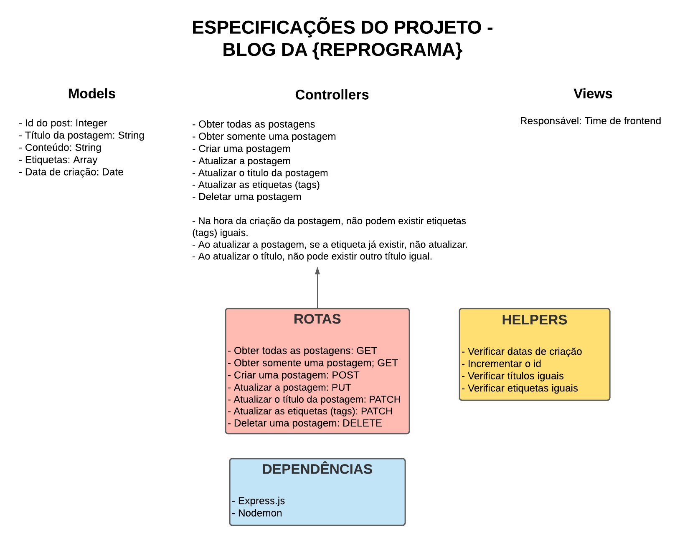

# Blog da Reprograma

O objetivo do projeto é criar novas postagens, visualizar todas ou apenas uma, atualizar postagens, título da postagem, etiquetas e deletar, utilizando boas práticas e estrutura de pastas, seguindo o design MVC. 

Foram adicionadas novas regras de negócios:

* Na hora da criação da postagem, não podem existir etiquetas(tags) iguais.
* Ao atualizar a postagem, se a etiqueta já existir, não atualizar.
* Ao atualizar o título, não pode existir outro título igual.

# Motivação

Aprender os conceitos de GET, POST, PUT, PATCH e DELETE, integrantes dos métodos HTTP.

# Arquitetura 

# Ferramentas utilizadas

* Nodejs
* Expressjs
* Cors
* Nodemon
